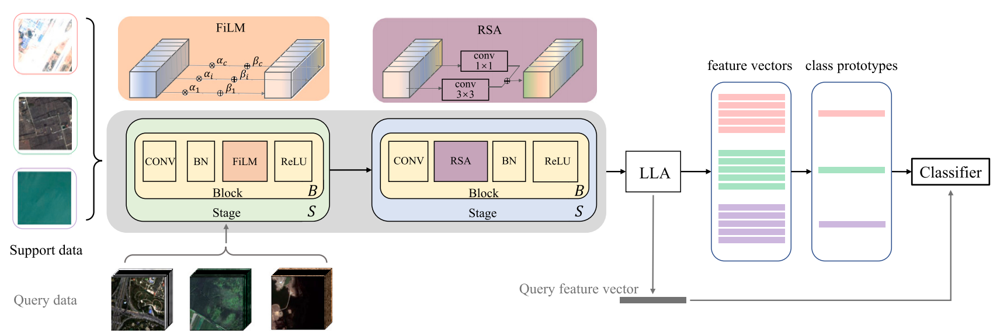
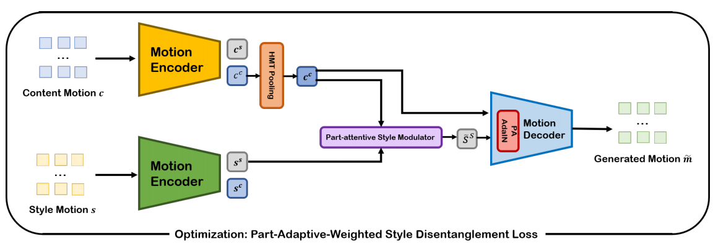
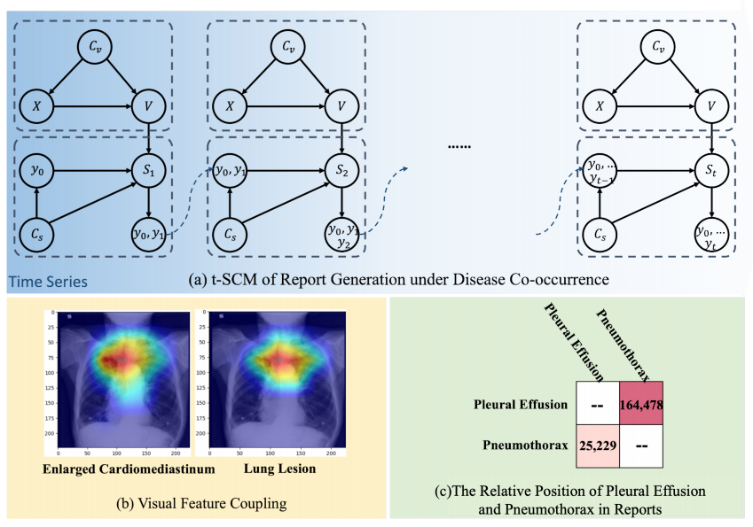
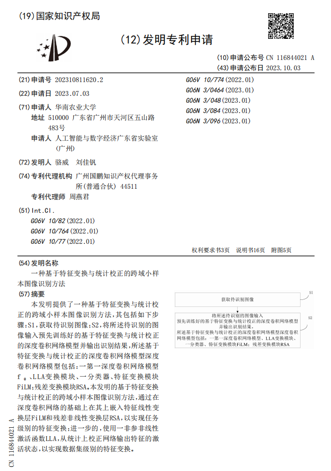
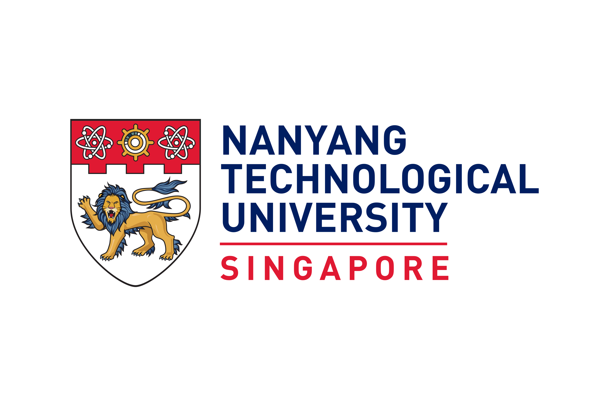
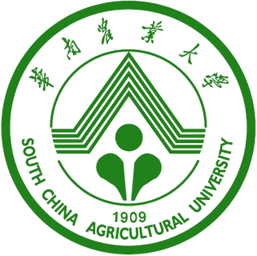
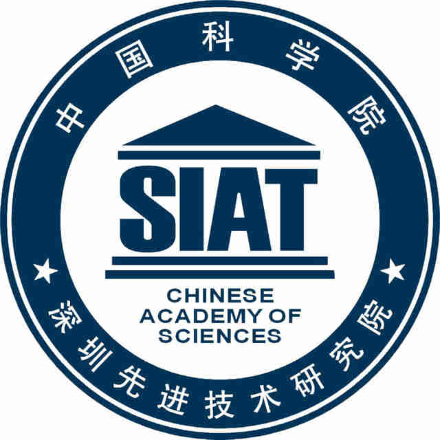

Publications

  
  

    <strong>Feature Transformation and Statistical Calibration for Cross-Domain Few-Shot Classification.</strong> 
    <strong>Jiafan Liu</strong>, Jin Deng, Jinrong Cui, Wei Luo 
    Engineering Applications of Artificial Intelligence (<strong>EAAI</strong>), 2025 &nbsp;<strong>(SCI Q1 Journal)</strong> 
    <a href="https://www.sciencedirect.com/science/article/abs/pii/S0952197625011820?via%3Dihub">Paper</a> |
    <a href="https://github.com/JiaHg/fetac">Code</a>
  

  
  

    <strong>A Comprehensive Body Part Adaptive Human Motion Style Transfer Method</strong> 
    <strong>Jiafan Liu</strong> 
    [<strong>Master Dissertation</strong>], 2025 
    <a href="https://dr.ntu.edu.sg/entities/publication/55bcfdb5-1276-45bf-aac5-355857bd9807">Paper</a>
  

  
  

    <strong>Rethinking Radiology Report Generation via Causal Inspired Counterfactual Augmentation.</strong> 
    Xiao Song, <strong>Jiafan Liu</strong>, Yan Liu, Yun Li, Wenbin Lei, Ruxin Wang 
    ACM Conference on Bioinformatics, Computational Biology, and Health Informatics (<strong>ACM-BCB</strong>), 2024 &nbsp;<strong>(CCF-C Conference, student first author)</strong> &nbsp;(Oral) 
    <a href="https://dl.acm.org/doi/10.1145/3698587.3701353#abstract">Paper</a>
  

  
  

    <strong>A Method for Cross-Domain Few-Shot Image Recognition Based Feature Transformation and Statistical Calibration</strong> 
    Wei Luo, <strong>Jiafan Liu</strong> 
    Patent Granted, 2023 &nbsp;<strong>(student first author)</strong>
  

---

Education

  
  

    <strong>Nanyang Technological University</strong> 
    Aug 2024 – June 2025 
    M.S. in Computer Control & Automation, School of Electrical and Electronic Engineering 
    <strong>GPA: 4.25 / 5.00 (Full Mark in EE6221, EE7204)</strong>
  

  
  

    <strong>South China Agricultural University</strong> 
    Sept 2020 – June 2024 
    B.S. in Information System, School of Mathematics and Information 
    <strong>GPA: 91 / 100 (ranking: 1 in class)</strong>
  

---

Internship

  
  

    <strong>Nanyang Technological University, <a href="https://www.ntu.edu.sg/rose">ROSE-Lab</a></strong> 
    Research Intern &nbsp;|&nbsp; Aug 2024 – March 2025 
    Supervisor: Prof. Alex Kot 
    Research Direction: [CV, Motion Generation] Human Motion Style Transfer
  

  
  

    <strong>Westlake University</strong> 
    Research Intern &nbsp;|&nbsp; Feb 2024 – June 2024 
    Supervisor: Prof. Stan Z. Li, Dr. Cheng Tan 
    Research Direction: [CV, Video Generation] Spatio-temporal Video Prediction
  

  
  

    <strong>Shenzhen Institute of Advanced Technology, CAS</strong> 
    Research Intern &nbsp;|&nbsp; Aug 2023 – Jan 2024 
    Supervisor: Prof. Ruxin Wang 
    Research Direction: [NLP, CV, Multi-Modality] Multimodal Medical Report Generation
  

---

Awards

- [2024] Outstanding Thesis Award
- [2022] National Innovation and Entrepreneurship Program **(Project Leader)**
- [2022] Outstanding Volunteer
- [2021 & 2022] SCAU Third-Class Scholarship